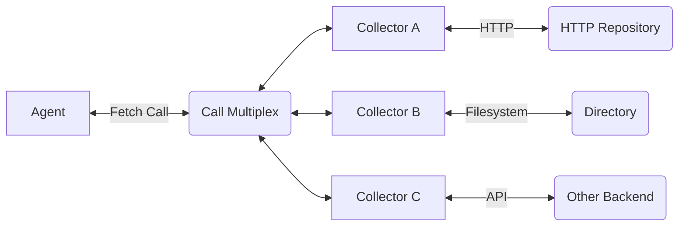

# Carabiner Attestation Collector and Parsers

This repository contains the carabiner attestation collector and various
parsers for envelopes, statment types (well, only in-toto is upported ATM!)
and predicates.

The two main consumers of this repository are 
[🔴🟡🟢 AMPEL](https://github.com/carabiner-dev/ampel)
and [🥨 bnd](https://github.com/carabiner-dev/bnd) but any project that
needs to download, read and query attestations can benefit from this module.

This project handles attestations using an abstraction above the vanilla intoto
attestations by relying on the
[Carabiner Attestation Framework](https://github.com/carabiner-dev/attestation).

# Concepts

We often talk about _The Collector_ but this is a very broad term.

In reality, all interactions are done using _The Agent_, an object that
coordinates reading and writing attestation data from _Repositories_ through
collectors that know how to talk to them:



## Definitions

Here are some definitions about each component. Most code definitions of the
following concepts are in interfaces in the 
[Carabiner Attestations Framework](https://github.com/carabiner-dev/attestation),
most definitions can be found in
[repository.go](https://github.com/carabiner-dev/attestation/blob/main/repository.go).

### Repository

A _Repository_ is a data source to read or write attestations. Repositories range
in complexity from a file (eg a jsonl file) all the way to a full system backed by
a database.

Repositories can vary in their capabilities, for example a repository may only
serve but not store attestations. Repositories can also implement more specialized
behaviors, for example may expose querying capabilities to fetch attestations by
predicate type or subject digest.

To talk to a repository, a collector driver needs to be implemented (see below).

### Collector Agent

The agent exposes the public API for attestation storage and retrieval. To read and
write data, an agent is configured with collectors that know how to retrieve data
from a specific repository.

### Collector Driver

A collector driver (or simply _a collector_), is a short program that implements
the `attestation.Fetch` (or `Store`) interface.

Collectors capture the logic to talk to a specific, instantiated repository type.
This means an agent loads a configured collector driver to communicate with an
instance of a repository type. For example, to read data from two jsonl files,
the agent loads two collectors for each driver.

Collectors can expose more advanced capabilities of a backend, for example if a 
collector implementes the `attestation.FetcherByPredicateType` interface, the agent
will use it to fetch by predicate type instead of pulling data and then filtering
it in memory.

## Attestation Queries

An _Attestation Query_ subsets a group of _Envelopes_ by applying a series of
filters. To run one, a program configures an `attestation.Query` object by loading
a number of filters and then `Run`s it on slice of attestations.

Here is a short example that filters a group of envelopes (wrapped attestations)
by looking for predicate types and digests:

```golang

    attestations := []attestation.Envelope{}

    // .... load here the attestations variable ...

    // Create a new query:
    query := attestation.NewQuery().WithFilter(
            // add a filter that looks for OpenVEX attestations:
			&filters.PredicateTypeMatcher{
				PredicateTypes: map[attestation.PredicateType]struct{}{
					attestation.PredicateType("https://openvex.dev/ns/v0.2.0"): struct{}{},
				},

            // add a filter that looks for a specific subject:
			}).WithFilter(
			&filters.SubjectHashMatcher{
				HashSets: []map[string]string{
					{"sha256": "2775bba8b2170bef2f91b79d4f179fd87724ffee32b4a20b8304856fd3bf4b8f"},
				},
			},
	)

    // Run the query:
    attestations = query.Run(attestations)
```

## Copyright

This project is Copyright &copy; by Carabiner Systems and released under the Apache-2.0 license, meaning you can use it and contribute back ideas and patches.
If you use the collector, be sure to let us know!!
 