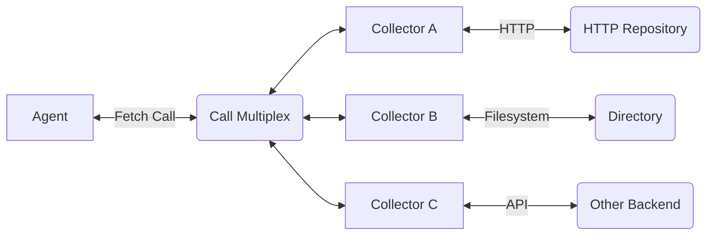

# Carabiner Attestation Collector and Parsers

This repository contains the carabiner attestation collector and various
parsers for envelopes, statment types (well, only in-toto is upported ATM!)
and predicates.

For more detailed documentation see the [`docs/`](docs/) directory:

- [**collectors.md**](docs/collectors.md) — overview of each built-in repository collector
- [**virtual-attestations.md**](docs/virtual-attestations.md) — how detached signatures become attestations
- [**limits.md**](docs/limits.md) — how read size and attestation count limits work
- [**api.md**](docs/api.md) — how to write your own repository collector

The two main consumers of this repository are 
[🔴🟡🟢 AMPEL](https://github.com/carabiner-dev/ampel)
and [🥨 bnd](https://github.com/carabiner-dev/bnd) but any project that
needs to download, read and query attestations can benefit from this module.

This project handles attestations using an abstraction above the vanilla intoto
attestations by relying on the
[Carabiner Attestation Framework](https://github.com/carabiner-dev/attestation).

## Repository Drivers

Repository drivers (or collectors) are the components that implement the logic to
read and write attestations from specific data sources. Each driver knows how to
communicate with a particular type of repository - whether it's a filesystem, a
remote API, a container registry, or other storage backends.

When creating a collector agent, you configure it with one or more repository
drivers by providing an initialization string that specifies both the driver type
and its configuration. The initialization string follows the format:
`<type-moniker>:<configuration>`.

### Available Drivers

The following table lists all repository drivers currently implemented in the project:

| Driver | Type Moniker | Description | Example Initialization String | Fetch | Store |
| --- | --- | --- | --- | --- | --- |
| **COCI** | `coci` | Reads Sigstore bundle attestations from container image registries using the `cosign` method. | `coci:docker.io/library/alpine:latest` | ✓ | ✗ |
| **OCI** | `oci` | Reads Sigstore bundle attestations attached as OCI referrers (cosign v3). | `oci:ghcr.io/foo/bar:v1` | ✓ | ✗ |
| **Filesystem** | `fs` | Reads attestation files from a filesystem directory | `fs:/path/to/attestations` | ✓ | ✗ |
| **GitHub** | `github` | Reads and writes attestations using the GitHub Attestations API | `github:owner/repo` | ✓ | ✓ |
| **HTTP/HTTPS** | `http`, `https` | Fetches attestations from HTTP(S) endpoints serving JSONL or bundle formats | `https://example.com/attestations.jsonl` | ✓ | ✗ |
| **JSONL** | `jsonl` | Reads attestations from JSON Lines (JSONL) formatted files | `jsonl:/path/to/file.jsonl` | ✓ | ✗ |
| **Git Notes** | `note` | Reads and writes attestations stored as git notes on repository commits | `note:git+https://github.com/owner/repo@abc123` or `note:file:///path/to/repo` | ✓ | ✓ |
| **Dynamic Git Notes** | `dnote` | Dynamically reads and writes attestations from git notes for any commit without preconfiguration | `dnote:https://github.com/owner/repo` | ✓ | ✓ |
| **OSS Rebuild** | `ossrebuild` | Fetches rebuild attestations from the OSS Rebuild project storage | `ossrebuild:` | ✓ | ✗ |
| **Release** | `release` | Reads attestations from GitHub release assets | `release:owner/repo@v1.0.0` | ✓ | ✗ |

All of these drivers can be used with tools that use Carabiner's collector such
as AMPEL or bnd. For more details on each driver see
[collectors.md](docs/collectors.md).

## Concepts

We often talk about _The Collector_ but this is a very broad term.

In reality, all interactions are done using _The Agent_, an object that
coordinates reading and writing attestation data from _Repositories_ through
collectors that know how to talk to them:


```mermaid
flowchart LR
    A[Agent] <-->|Fetch Call| B(Call Multiplex)
    B <--> C1[Collector A]
    B <--> C2[Collector B]
    B <--> C3[Collector C]
    C1 <-->|HTTP| D1(HTTP Repository)
    C2 <-->|Filesystem| D2(Directory)
    C3 <-->|API| D3(Other Backend)
```

## Definitions

Here are some definitions about each component. Most code definitions of the
following concepts are in interfaces in the 
[Carabiner Attestations Framework](https://github.com/carabiner-dev/attestation),
most definitions can be found in
[repository.go](https://github.com/carabiner-dev/attestation/blob/main/repository.go).

### Repository

A _Repository_ is a data source to read or write attestations. Repositories range
in complexity from a file (eg a jsonl file) all the way to a full system backed by
a database.

Repositories can vary in their capabilities, for example a repository may only
serve but not store attestations. Repositories can also implement more specialized
behaviors, for example may expose querying capabilities to fetch attestations by
predicate type or subject digest.

To talk to a repository, a collector driver needs to be implemented (see below).

### Collector Agent

The agent exposes the public API for attestation storage and retrieval. To read and
write data, an agent is configured with collectors that know how to retrieve data
from a specific repository.

### Collector Driver

A collector driver (or simply _a collector_), is a short program that implements
the `attestation.Fetch` (or `Store`) interface.

Collectors capture the logic to talk to a specific, instantiated repository type.
This means an agent loads a configured collector driver to communicate with an
instance of a repository type. For example, to read data from two jsonl files,
the agent loads two collectors for each driver.

Collectors can expose more advanced capabilities of a backend, for example if a
collector implementes the `attestation.FetcherByPredicateType` interface, the agent
will use it to fetch by predicate type instead of pulling data and then filtering
it in memory.

To learn how to write your own collector, see [api.md](docs/api.md).

### Resource Limits

The collector agent enforces read size limits and attestation count limits to
prevent resource exhaustion. By default, no single source can deliver more than
7 MiB of data, and callers can cap the number of returned attestations per fetch.
Both limits are propagated from the agent to every repository collector through
`FetchOptions`. For full details, see [limits.md](docs/limits.md).

## Virtual Attestations from Detached Signatures

Filesystem-derived collectors (**fs**, **release**, and **git**) can synthesize
"virtual" attestations from detached signature files found alongside artifacts.
When a file like `artifact.tar.gz.sig` or `artifact.tar.gz.sigstore.json` is
found next to `artifact.tar.gz`, the collector verifies the signature and
produces an in-toto attestation with predicate type
`https://carabiner.dev/ampel/signature/v1` whose subject is the signed artifact.

Two kinds of detached signatures are supported:

- **Raw signatures** (`.sig`, `.gpg`, `.asc`) — verified against public keys
  registered on the agent via `WithKeys` or `WithKeyFiles`.
- **Sigstore message-signature bundles** (`.sigstore.json`) — verified using the
  Sigstore trust root; the artifact digest is extracted directly from the bundle
  so the companion file does not need to be read.

For full details see [virtual-attestations.md](docs/virtual-attestations.md).

## Attestation Queries

An _Attestation Query_ subsets a group of _Envelopes_ by applying a series of
filters. To run one, a program configures an `attestation.Query` object by loading
a number of filters and then `Run`s it on slice of attestations.

Here is a short example that filters a group of envelopes (wrapped attestations)
by looking for predicate types and digests:

```golang

    attestations := []attestation.Envelope{}

    // .... load here the attestations variable ...

    // Create a new query:
    query := attestation.NewQuery().WithFilter(
            // add a filter that looks for OpenVEX attestations:
			&filters.PredicateTypeMatcher{
				PredicateTypes: map[attestation.PredicateType]struct{}{
					attestation.PredicateType("https://openvex.dev/ns/v0.2.0"): struct{}{},
				},

            // add a filter that looks for a specific subject:
			}).WithFilter(
			&filters.SubjectHashMatcher{
				HashSets: []map[string]string{
					{"sha256": "2775bba8b2170bef2f91b79d4f179fd87724ffee32b4a20b8304856fd3bf4b8f"},
				},
			},
	)

    // Run the query:
    attestations = query.Run(attestations)
```

## Copyright

This project is Copyright &copy; by Carabiner Systems and released under the Apache-2.0 license, meaning you can use it and contribute back ideas and patches.
If you use the collector, be sure to let us know!!
 